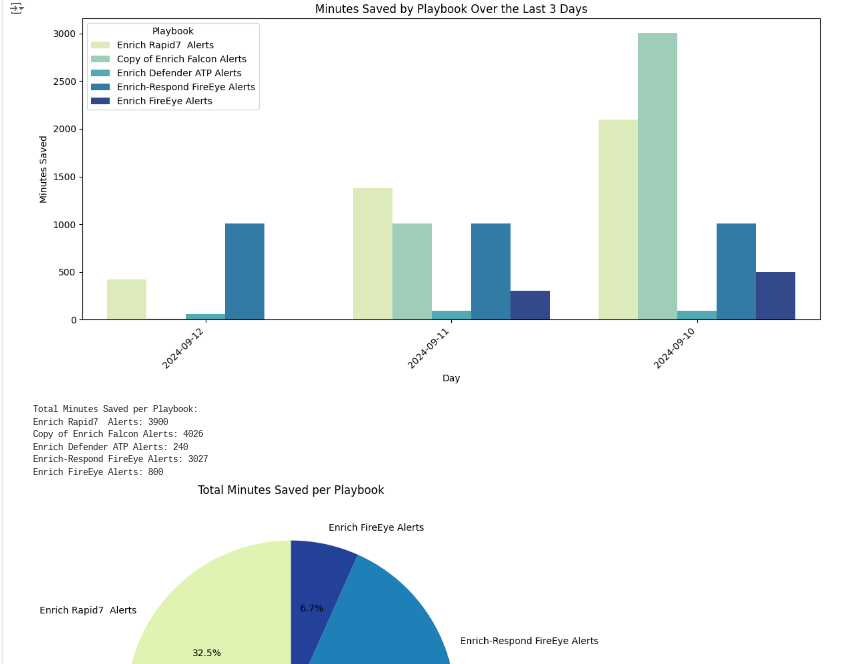
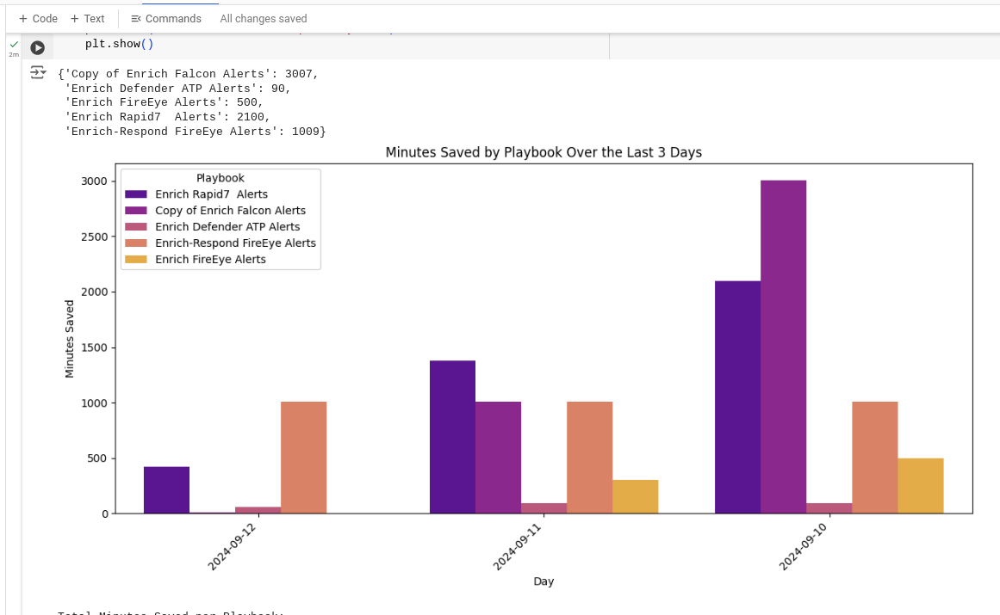
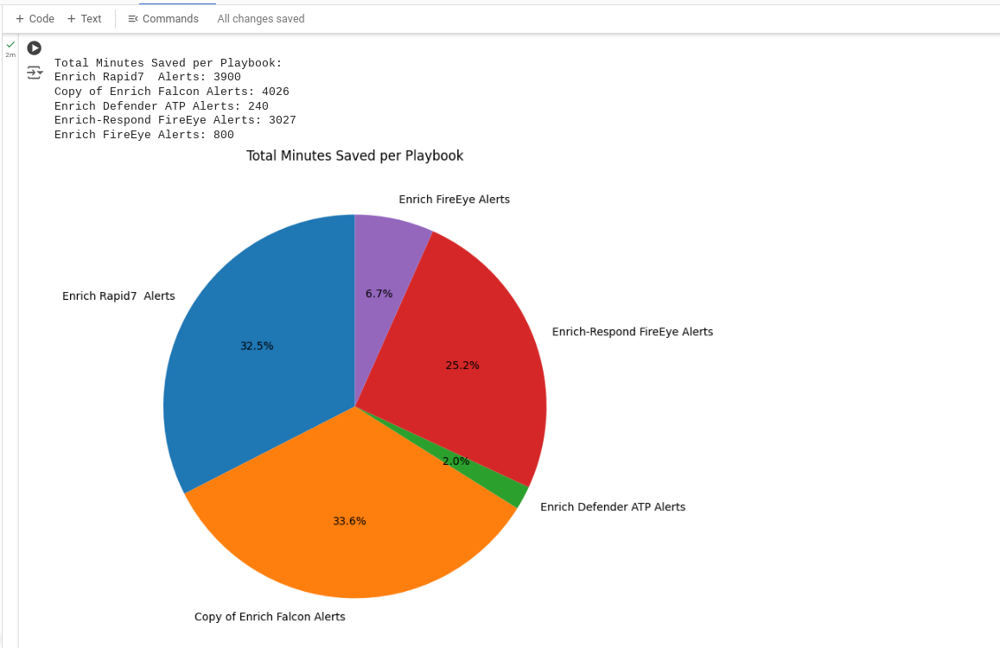

This repo contains Google SecOps/SOAR helper scripts.

`roi-report-seaborn.py` is meant to run in a Jupyter notebook and uses the Seaborn visualization library to generate charts for SOAR return on investment.

